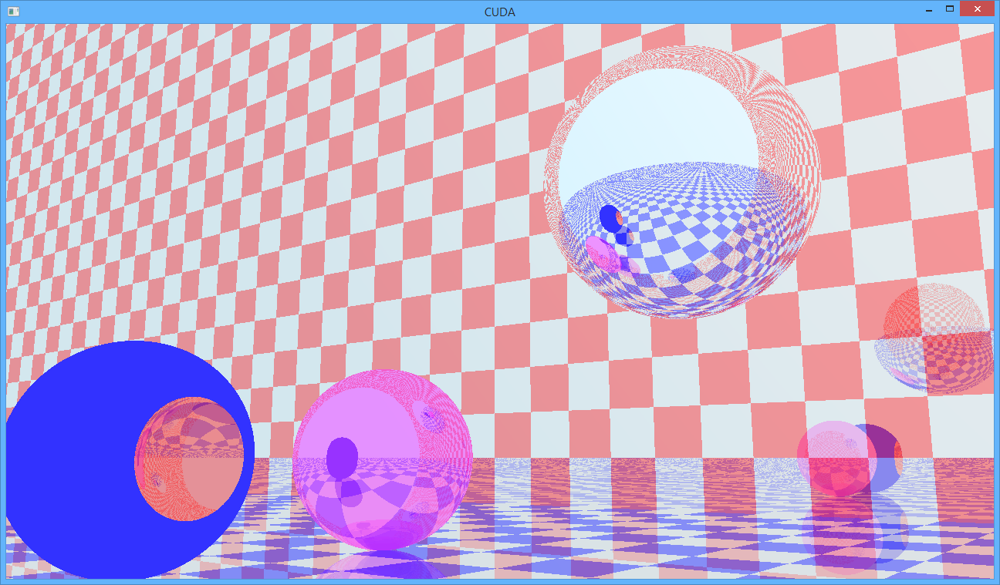

# rayy
Simple raycast renderer using CUDA

When running, use a game controller to move around and explore the space.
Supports reflections and light portals, supports spheres, planes, and subtractive geometry.
